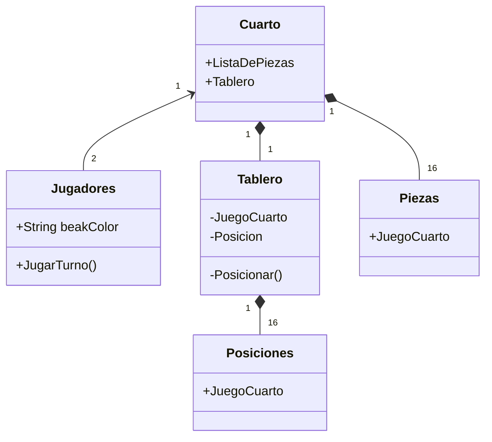
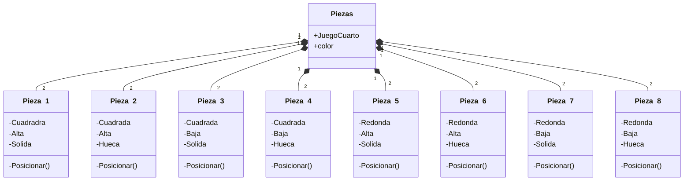

# Reto-dos

# Juego de mesa quarto o cuarto
El juego de mesa que realicé fue Quarto, un juego que me parece bastante entretenido y estratégico, parecido al ajedrez. Se cuentan con un total de 8 fichas por cada jugador, en un tablero de 4x4. Cada una de las fichas cuenta con características únicas como la altura, la forma, el color o su contenido (si es sólida o hueca). Para ganar, se necesita hacer una línea de 4 fichas con una misma característica. Por ejemplo, un jugador gana si pone la última ficha en una fila de 4 piezas con la característica cuadrada, todas las fichas presentan esta característica y forman un cuarto.
Para empezar, un jugador elige la ficha de su rival, luego el rival elige dónde va a colocar la ficha hasta que se terminen las fichas o se realice el cuarto.

